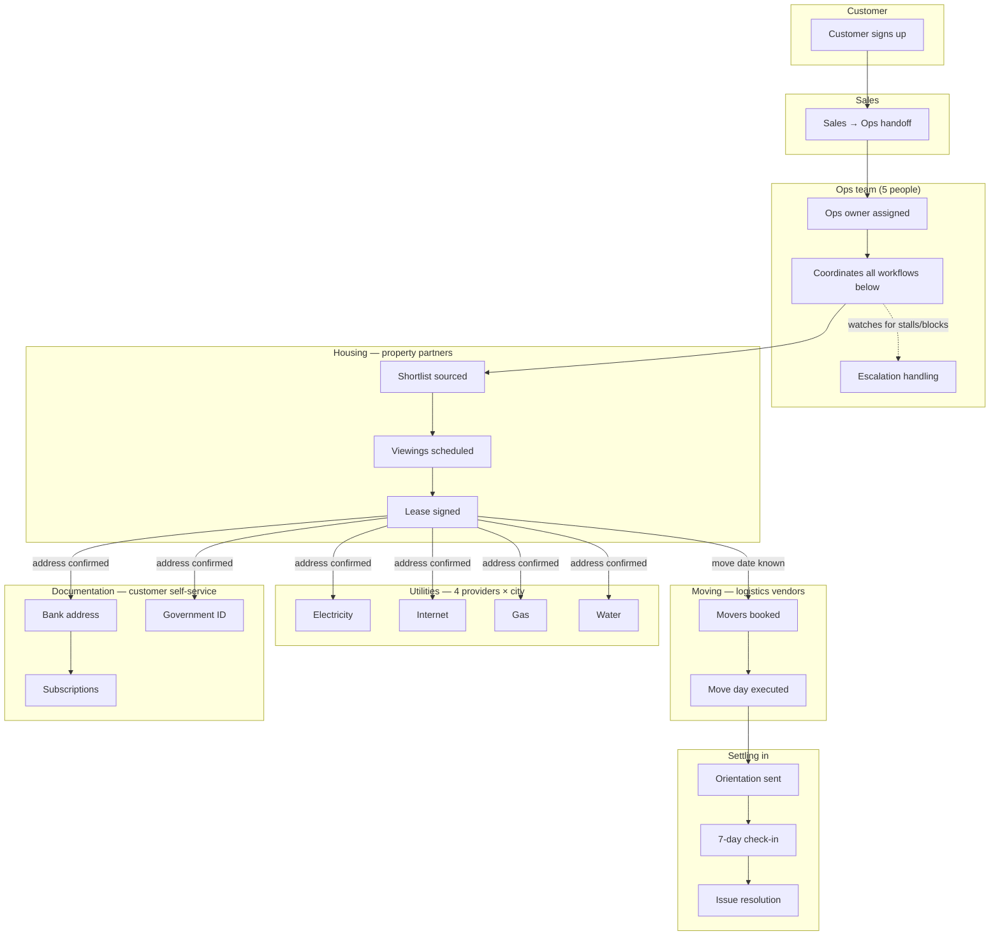

# The Map — QuickMove Operations, as a System

**Rithesh Suvarna** — AI Ops Engineer hiring assignment, Submission 1 (StampMyVisa). Built collaboratively with Claude Code, as the assignment's rules explicitly invite.

---

## 1. The system, end to end

QuickMove sits between a relocating customer and a mesh of city-local vendors, coordinated almost entirely by 5 ops people through WhatsApp, Google Sheets, and email. The core insight that shapes everything below: **the checklist looks the same across all 8 cities, but the graph of who-depends-on-whom underneath it does not.** A relocation to Bengaluru and one to Kolkata share a template; they do not share a single vendor, timeline, or failure mode.

The single arrow worth staring at: **lease signed is a fan-out gate.** Four utility workflows, two documentation workflows, and the move-day booking all wait on it. A slow lease signing doesn't just delay housing — it silently delays six other workflows that look, on a spreadsheet, like they're each running on their own schedule.

---

## 2. Stakeholders

| Stakeholder | Role | Currently visible to ops? |
|---|---|---|
| Customer | The person relocating | Yes — direct WhatsApp contact |
| Customer's family | Often co-decides on housing (budget, schools, commute) | **No** — invisible approval loop |
| Sales/onboarding | Hands off the signed customer to ops | Partially — handoff quality varies |
| Ops team (5 people) | On-ground coordination across every workflow | — |
| Management | Needs visibility into health/throughput | **No system exists for this today** |
| Property partners (per city) | Source and show apartments | Yes, but inconsistent SLAs |
| Landlords | The actual decision-maker behind each partner | **No** — one layer removed, invisible when things stall |
| Moving vendors (per city) | Packers & movers | Yes |
| Utility providers (×4, per city) | Up to 32 distinct vendor relationships across 8 cities | Partially — lead times not tracked anywhere |
| Banks / government offices | Process address-change paperwork | No direct relationship — customer-mediated |
| Subscription services | Customer's own accounts (courier, gym, streaming, insurance) | **No canonical list exists anywhere** |
| Society / RWA (per building) | Often gates mover access with an undocumented NOC requirement | **No** — surfaces only on move day |
| Finance (implied) | Vendor payments, customer billing | Not modeled in the current process at all |

---

## 3. Workflow inventory

Anyone can list the 6 stages on the checklist. Broken into what ops actually has to *do*, there are 31:

**Pre-move (3)**
1. Lead-to-ops handoff
2. Requirement gathering (budget, city, timeline, family size, pets)
3. Ops owner assignment / workload balancing across the 5-person team

**Housing (6)**
4. Property partner sourcing/shortlist request
5. Shortlist curation & delivery to customer
6. Viewing scheduling (customer availability × partner availability)
7. Viewing execution & feedback loop
8. Lease negotiation
9. Lease signing & deposit coordination

**Moving (5)**
10. Mover vendor selection & quote comparison
11. Move booking & scheduling
12. Packing logistics coordination
13. Move-day on-site execution
14. Post-move inventory/damage check

**Utilities — ×4 per city (4)**
15. Electricity application & activation
16. Internet/ISP selection & installation
17. Gas connection (piped vs. cylinder varies enormously by city)
18. Water connection / society NOC coordination

**Documentation (5)**
19. Bank address update
20. Government ID/address update (Aadhaar, license, passport — often 2–3 separate processes, not one)
21. Vehicle registration transfer (if applicable)
22. Subscription & service address updates
23. School/childcare enrollment (families with kids — frequently missed entirely)

**Settling in (3)**
24. Local orientation content delivery
25. 7-day check-in
26. Ongoing issue/complaint resolution (open-ended, not a single step)

**Cross-cutting operations (5)**
27. Vendor performance tracking / scorecarding
28. Customer status communication
29. Escalation handling
30. Cancellations / mid-process drop-outs
31. Vendor invoicing & payment reconciliation

---

## 4. Top 3 automation opportunities, ranked

**1. Structured status tracking + escalation detection.** This is the foundation, not a feature — it touches every one of the 31 workflows above, every day, for every relocation. The single highest hidden cost in the current process isn't any one broken workflow; it's that *nothing surfaces itself*. A stalled utility connection and a customer waiting on a bank address update look identical in a WhatsApp thread: silent. Nothing else on this list compounds without this existing first.

**2. AI parsing of freeform WhatsApp-style updates into structured checklist state.** Ranked second, deliberately, because it isn't a value source on its own — it's the *adoption unlock* for #1. Ops already communicates this way, all day, across 5 people. Asking them to also manually re-enter status into a separate tool is exactly why spreadsheet-based trackers die within a month. This removes that tax entirely.

**3. AI-drafted customer status messages.** The most customer-visible win, but correctly ranked last: drafting a message from garbage state produces a garbage message. It only becomes safe and valuable once #1 and #2 make the underlying state trustworthy.

*(Lower-priority, worth naming: automated apartment-shortlist matching — high potential value, but blocked on property-partner data feeds that don't exist yet, so low feasibility short-term. Predictive SLA-breach alerts — a strong v2, but structurally dependent on #1's data existing first.)*

**What was built for Submission 2:** #1 and #2, combined, with #3 layered on top — a working relocation tracker with a real checklist engine, persisted escalation detection, and both AI features, hardened past the original prototype (server-side AI calls only, audit history on every status change, per-city-capable checklist templates, graceful offline fallback).

---

## 5. Health metrics, per workflow

| Workflow | Metric |
|---|---|
| Housing | Kickoff → lease-signed cycle time; shortlist→viewing and viewing→signed conversion rates; % stalled >X days |
| Moving | % bookings confirmed ≥7 days pre-move; move-day on-time rate; vendor cancellation rate |
| Utilities | Avg days-to-connect per utility type *per city* (this must be city-sliced — a blended average hides the real risk); % connected within 2 days of move-in; SLA breach rate per provider |
| Documentation | % tasks completed within 14 days of move — typically the laggard, since it's customer-driven, not ops-driven |
| Settling in | 7-day check-in completion rate; post-move issue count per relocation; time-to-resolution |
| Cross-cutting | Overall cycle time (kickoff → fully complete); % relocations with ≥1 open blocker; avg time an item sits stalled before someone acts; ops workload balance across the 5-person team; escalation response time |
| AI features | WhatsApp-parser acceptance rate (% of AI suggestions applied unedited — the real trust signal, not "did it run"); message-drafter edit rate before sending |

---

## 6. Edge cases and failure modes most people would miss

**The obvious ones** (anyone finds these): duplicate relocation records, invalid/past move dates, API/AI failures, storage failures.

**The ones underneath:**

- **Lease signing is a hidden dependency gate, not just a housing task.** Utilities, documentation, and move-day booking all silently wait on it. A checklist that tracks these five items independently hides the fact that one delay cascades into four.
- **Documentation is customer-dependent, not ops-dependent** — a fundamentally different failure mode than every other workflow. Ops can't "do" a bank address update; they can only nudge. A tracker that treats it like any other task will over-attribute blame to ops for delays that are actually about customer follow-through.
- **The landlord is invisible.** Ops sees "property partner unresponsive," but the actual blocker is often one layer further down, at the landlord, where ops has no relationship and no visibility at all.
- **Family decision-making is an unmodeled approval loop.** Housing choices often need two people to agree; "customer selects shortlist item" hides a negotiation that can stall for reasons no checklist item captures.
- **Society/RWA NOC requirements** can block mover access on move day even after every other checklist item is green — a purely local, often undocumented gate that only surfaces at the worst possible time.
- **Vendor double-booking.** A mover vendor operating across multiple QuickMove customers can accept two bookings for the same crew on the same date; nothing in a per-relocation checklist would ever catch this until move day.
- **The subscriptions checklist item has no canonical source.** There is no list anywhere of what a customer's subscriptions even are — "done" on this item is often a guess, not a verified fact.
- **20% QoQ growth compounds coordination overhead, not just workload.** Adding a 6th and 7th ops person to a WhatsApp-and-Sheets process doesn't linearly add capacity — more people sharing tribal knowledge through chat threads increases the odds any given thing gets missed.
- **Ops handoff on leave/turnover loses undocumented context** — the current process has no structured record of *why* a decision was made, only that a status changed.
- **PII currently lives in plaintext WhatsApp/Sheets** — bank details and ID numbers, with no data-handling policy. Invisible until it's an incident.
- **Peak clustering.** Move dates cluster around month-end; vendor and ops capacity doesn't, creating a predictable seasonal bottleneck that a monthly-average metric would never reveal.

---

— Rithesh Suvarna
